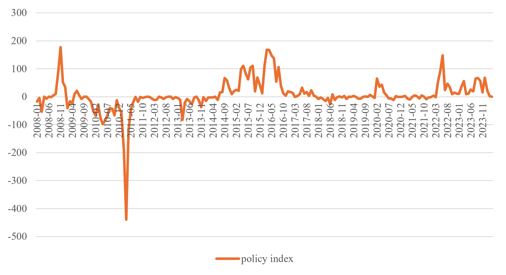

## Abstract

This paper examines the relationship between housing policy interventions and market returns in China with a novel policy index. Using natural language processing techniques, we construct a sentence-level policy index based on government policy documents from 2008 to 2024. The policy index captures not only major periods of loosening and tightening but also finer shifts in government stance. We find that policies with a stronger loosening orientation – reflected by higher index values – are associated with higher long-term housing returns, while no significant effects are observed in the short run, suggesting a delayed impact of policy measures on market outcomes. Mechanism analysis shows that policy effects on housing returns are primarily transmitted through supply channel (42%) rather than demand channel (19%), consistent with land supply being fully controlled by the government. Furthermore, lead-lag analysis uncovers that housing returns lead policy changes across all time horizons, indicating that policies are generally countercyclical. 

## Important table & figure

::: {layout-ncol="2"}

:::

## Attachment

The monthly policy index constructed in this paper is available for download:

<a href="att/policy_index.xlsx" class="btn btn-outline-dark btn-sm" download="policy_index.xlsx"><i class="bi bi-file-earmark-excel"></i> policy_index.xlsx</a>

<!--  -->